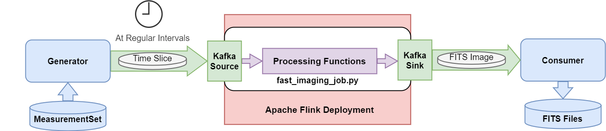
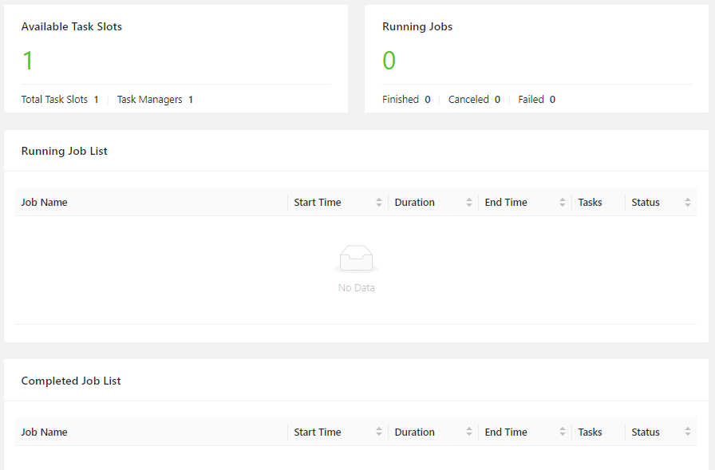
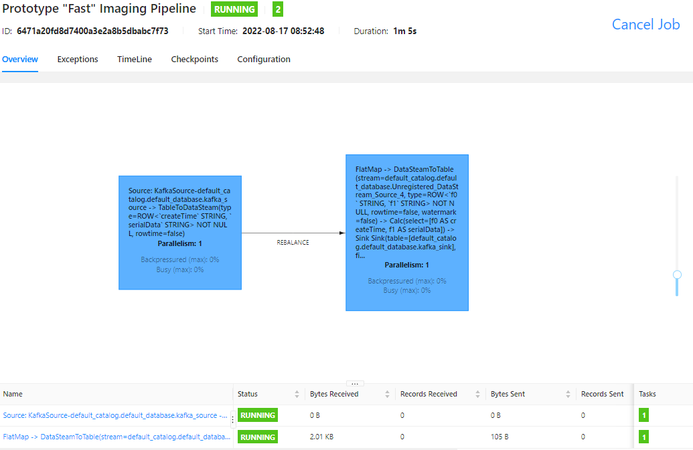
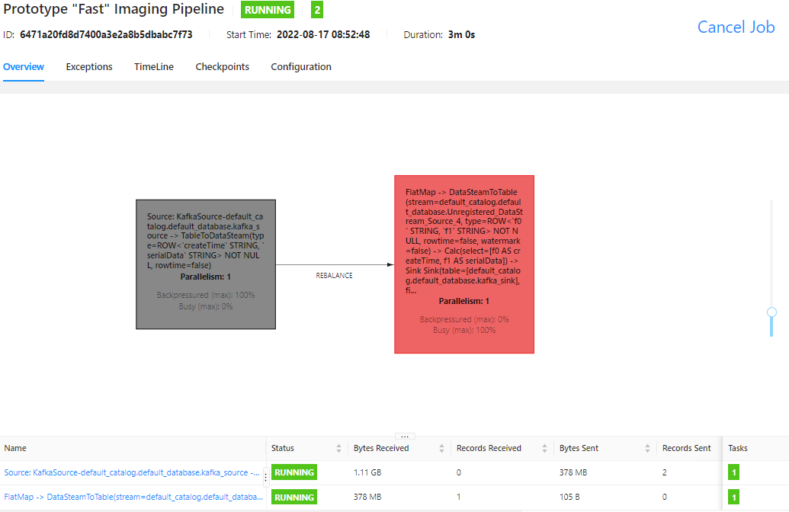
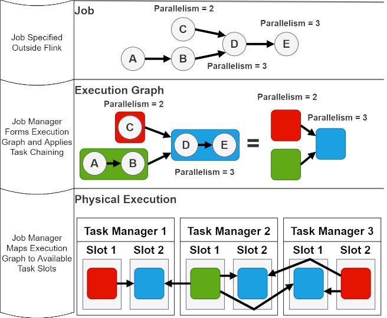

## Fast Imaging Pipeline Prototype Using FLink
This pipeline implements a distributed streaming pipeline with GPU acceleration which creates dirty images from time slices of visibility data in a MeasurementSet. The key processing part of the pipeline uses Apache Flink to run functions from the processing function library in a way which can be distributed. For more information on Flink see the last section in this document.

Apache Flink is a framework for stateful streaming processing with exactly once state consistency. It achieves high performance by leveraging in memory speeds when working with state. Flink is used by large organisations including: Amazon, Alibaba, Tencent and Ericsson.

As this is a prototype Kafka is used to supply the data to the Flink processing as well as to transport the data away. This works in this prototype to showcase the flink based processing but for a real-world real-time deployment other methods of supplying and saving data (called sources and sinks in Flink) are likely more appropriate.

### Overview of Pipeline
The pipeline (shown pictorially in ***Fig. 2***) implemented as a Flink job consist of the following steps:

1. A Generator process reads Visibility data from a MeasurementSet and at regular intervals sends data corresponding to one time slice using Apache Kafka
2. The Flink Job ``fast_imaging_job.py``, runs on the Flink Cluster, the Flink Jobmanager distributes the work to available workers/taskmanagers. (A) The FLink Job reads data from a Kafka Sink. (B) The FLink Job preforms GPU accelerated processing using the SKA Processing Function Library, this produces dirty images in the FITS format. (C) The Flink Job writes the results to a Kafka Sink.
3. A Consumer process writes the FITS image files produced to disk.

Out of the above steps, only step 2, performs the actual Fast Image Processing using the SKA Processing Function Library, Steps 1 and 3 are simply needed to supply and save data.

         
***Fig. 2** Overview of the Fast Imaging Pipeline in this prototype.*

## Processing Pipeline
The fast imaging pipeline is implemented using compartmentalised Python functions ``development/python_pipeline_implementation.py``. For illustrative purposes, and as a test bed to support further development, these functions are used to implement the same processing in Python as is done in the pipelined deployed using Flink.

This example and testbed of the pipeline and the actual Flink pipeline, uses the functions as in ***Fig. 3***. Where serialization and deserialization is not needed in Python is it used in the deployed pipeline when transferring the data using Kafka, it is included in the Python example so that it is a close a mapping as possible to the pipeline which is deployed.
         
***Fig. 3** Overview of the Fast Imaging Pipeline in this prototype.*
## Running the Job
**Requirements:**
```
RAM: 64Gb
GPU: Nvidia GPU with Cuda 11.0 or above

Data: A MeasurementSet with data to be turned into dirty images
```
To test that drivers and 
**If you are running this example remotely using ssh you may need to forward ports to see the web UI's from your local browser**. For a remote machine named: `<remote machine>` this may be done using:
```
ssh -L 1234:localhost:8081 -L <remote machine>
```
Then modify the port numbers appropriately when accessing the web UI's. So Flink web UI would then be on port 1234.

### Installing Docker
**Since the example is containerised and relies on docker-compose you need to have the docker engine and docker compose installed.**
The instructions [here](https://docs.docker.com/engine/install/) show how to install docker. On Linux you can use the following commands to install what you need:
```
sudo apt-get update
sudo apt-get install docker-ce docker-ce-cli containerd.io docker-compose-plugin
```
Run the following command to verify that docker is installed.
```
sudo docker run hello-world
```

### With Docker Installed
To check that docker with nvidia is installed, see [here](https://docs.nvidia.com/datacenter/cloud-native/container-toolkit/install-guide.html) and run:
```
sudo docker run --rm --gpus all nvidia/cuda:11.0.3-base-ubuntu20.04 nvidia-smi
```
**In order to run the containers in this repository you need to make sure `docker-entrypoint.sh` is executable. So run:**
```
chmod +x docker-entrypoint.sh
```
**It may be useful to clear the ``consumer/fits`` directory if the pipeline has been ran earlier: ``rm -r -f ./consumer/fits/*``**

To be able to start the example, build the images (thus uses the Dockerfile files specified in docker-compose.yml and may take up to 6 min):
````commandline
sudo docker-compose build
````

Make sure that the directory containing the measurement set is mounted to the generator, by default this is assumed to be ``/mnt/FIP/``. Then start the containers
````
sudo docker-compose up -d
````

Since the Flink container is now running you should see that you have one task manager ([covered here](../FlinkandPyflink.md)) with two task slots and no jobs running. If you open Flink Web UI [http://localhost:8081](http://localhost:8081) it should look as in ***Fig. 4***

         
***Fig. 4** Flink Web UI on start-up.*

Submit the job using
````commandline
sudo docker-compose exec jobmanager ./bin/flink run -py /opt/example-pipeline/fast_imaging_job.py -p 1 -d -pyfs pipeline_functions.py
````

**The job is launched with specified parallelism of 1, (as seen from ``-p <parallelism>``) and therefore requires at least 1 task slots.**.

The job should now be shown as running in the UI and if you click the job name you will get information regarding the job, as in ***Fig. 5***.

         
***Fig. 5** Flink Web UI showing the job.*

**Start the generator to send the MeasurementSet**

Given that you have a measurement set, for example as in HIP-297. To start a generator process to send slices of a MeasurementSet.
```
sudo docker-compose run -d --name generator_job generator python3 -u ./generate_source_data.py <local path to MeasurementSet>
```
For example:
```
sudo docker-compose run -d --name generator_job generator python3 -u ./generate_source_data.py /mnt/FIP/1636091170_sdp_l0_1024ch_MTP0013_scan8.ms
```

To see that the generator is indeed sending the data, view its logs using:

```
sudo docker logs generator_job -f
```

**Check the job to verify that it is processing records**

Check Flink Web UI [http://localhost:8081](http://localhost:8081) or at the forwarded port.
You should see that the "Records Received" and "Bytes Received" fields for the job are steadily increasing as dirty images are produced. As in ***Fig. 6***.

         
***Fig. 6** Flink Web UI showing the job running.*

**Check that dirty images are written to FITS files**

The dirty images are written to FITS files in the consumer/fits folder. This folder should be steadily populated as dirty images are generated.

**To view dirty images: Generate .png images and a .mp4 movie**
This is purely for illustrative purposes, not a part of the processing pipeline but post-processing for demos etc.
To generate png files, enter the functions directory and make a ``pics`` directory

```
cd functions
mkdir pics
```
Now in the ``functions`` directory run the ``flink_make_mp4.py`` script:
```
python3 flink_make_mp4.py ../consumer/fits
```
The individual images are now in the ``pics`` directory, with the mp4 movie saved to ``fits.mp4``
Images may appear as in ***Fig. 7***

         
***Fig. 7** Example of how the dirty png images may look.*

To shut down the example use.
```
sudo docker-compose down
```
## When the Job is Running

## Stopping the example
To shut down the example.
```
sudo docker-compose down
```
**The above command will stop the containers but keep the images, so there is no need to rebuild.**
However the volumes will remain, and this can cause the used size to be significant.

To shut down the example and delete volumes and remove images **instead of above command** run:
```
sudo docker-compose down --rmi all -v
```
To remove *ALL (BE AWARE)* images, even unused ones use:
```
sudo docker image prune -a
```
To remove *ALL (BE AWARE)* volumes, even unused ones use:
```
sudo docker volume rm $(sudo docker volume ls -q)
```
## Deploying pipeline to multiple nodes
Information on how to deploy the pipeline with Flink workers/TaskManagers on multiple nodes using Docker Swarm is found in ``multi-node_instructions.md``. For multi-node deployments using swarm the compose file ``docker-compose-swarm.yml`` is used instead of the default one, this file contains modifications required to run on multiple nodes. 

## Developing or Modifying the Pipeline
When developing the pipeline there are three main areas which may need to be modified. These are:
1. The Pipeline Functions
2. The Flink Job
3. The Docker Images

1 If the pipeline is expected to perform another type of processing the python functions in ``functions/pipeline_functions.py`` should be modified and perhaps additional functions added. It is advised to test the functioning of the processing using ``development/python_pipeline_implementation.py`` or a similar script.

2 Once you are able to do the required processing you may have to modify the Flink job. This may be required if you want to change the table-api sources and sinks used to feed data into the pipeline, for example so they use a different technology which is not Kafka. Modifying the flink job is also needed if you want to implement a stateful processing function (that is a processing function dependent on more than one record). Examples of stateful and windowing functions implemented in flink using the pyflink interface can be found in the [SKA Distributed QA Example](https://gitlab.com/ska-telescope/sdp/ska-sdp-qa-metric-generator-distributed-prototype) repository. To modify the Flink job the python flink api should be used, it is documented [here](https://nightlies.apache.org/flink/flink-docs-stable/) however since there is more information on the Java API it may sometimes be necessary to find the solution to your problem expressed in the Java API online and then consult the [Flink Python Source](https://github.com/apache/flink/tree/master/flink-python) to recreate it in Python. 

3 The docker images can be thought of as the commands you would need to run on a clean ubuntu machine in order to enable it to run the code you want. For example to add files, install python, install flink install the processing function library etc, these are then built and saved as images, prebuilt images for kafka etc are also used. All of the Dockerfile files included in this project serve to go through a series of steps required to provide a number of necessary dependencies the image requires. When consulting the dockerfiles each section contains comments stating what the purpose of the code bellow is and usually where that code was obtained from (often the code was obtained by consulting the Dockerfiles of other images on the docker hub).
When troubleshooting in the process of building an image it is helpful to be able to enter a container to check that it does indeed include the files one expects and that relevant dependencies are installed correctly. To do this, build and start the relevant container (build and then compose up). then check the container is running: ``sudo docker ps -a``, and if it is you can launch a shell inside it using ``sudo docker exec -i <container name> /bin/sh``, you can then run for example nvidia-smi to check the container can use the GPU.
## Apache Flink for streaming

A Flink deployment consists of two main parts, running in separated containers, a **job manager**, and one or several **task managers**. Task managers are the worker processes in Flink. Each task manager has one or several **task slots**. The job manager allocates work to the task slots of different task managers.

Flink works by that you submit a **Flink job**, this is a high level description of how you want to process a datastream stream. Using python and pyflink you can create a job file. The job specifies what operations should take place on the stream and in what order, as well as the sources and sinks of the stream outside Flink. 

To execute a job, you submit it to the **job manager**. When receiving a job the job manager translates the instructions into an execution graph, this can involve "chaining" logically connected parts of a job together, called task chaining. Task chaining is done for performance as "fused tasks exchange records by method calls and thus with basically no communication costs" [[1](https://learning.oreilly.com/library/view/stream-processing-with/9781491974285/ch10.html#chap-10-chaining)]. Having formed an execution graph the job manager looks at the task managers (workers) and task slots available and maps the execution graph to the task slots in such a way to optimise for performance, for example by putting tasks which communicate heavily on task slots on the same worker, to reduce communication costs. Tasks in slots on the same task manager can exchange data effectively, but tasks in slots on different task managers communicate over slower network protocols. 

For a job consisting of processes **A**,**B**,**C**,**D**,**E** with specified parallelisms, the process of: (1) specifying a job, (2) execution graph creation and task chaining, (3) then mapping to cluster resources is shown in ***Fig. 1***, this image is a toy picture to illustrate the concepts, not meant to depict ground truth. Chapter 3 of [this book](https://learning.oreilly.com/library/view/stream-processing-with/9781491974285/ch03.html#chap-3-app-deployment) contains good illustrations and useful information on this.

       
***Fig. 1** How a Flink job is transformed into an execution graph and then mapped to available task slots.*


Task chaining as well as how other job manager optimisations are applied, can be controlled to further improve performance. Such optimisations include slot sharing groups, controlling what tasks should be executed in the same slot.
In the job there can be an overall parallelism specified, this is tells the job manager what parallelism all, or parts, of the job should execute with.  In the job you can also specify a checkpointing strategy: how often to back up the state if an error occurs, and a restart strategy: how to attempt restarts if a job fails.

## Possible errors:
### When composing up the containers
If you see an error along the lines of:
```
Cannot start service consumer: failed to create shim: OCI runtime create failed: container_linux.go:380: starting container process caused: process_linux.go:545: container init caused: Running hook #0:: error running hook: exit status 1, stdout: , stderr: Auto-detected mode as 'legacy'
```
check that the nvidia drivers are up-to-date using:
```
nvidia-smi
```
if the output is:
```
NVIDIA-SMI has failed because it couldn't communicate with the NVIDIA driver. Make sure that the latest NVIDIA driver is installed and running.
```
Then update drivers and try again.
(to see what driver you should get, find what card you have:
``sudo update-pciids`` and then ``lspci | grep VGA``
)